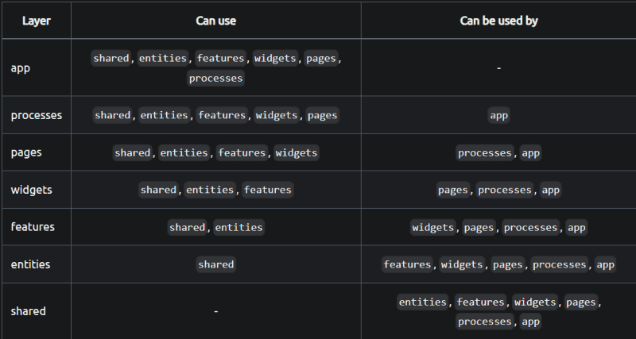

### 프로젝트 개요

이 프로젝트는 Next.js 13과 Feature-Sliced Design (FSD) 방법론을 적용한 웹 애플리케이션입니다. FSD는 기능 단위로 코드를 나누어 유지보수성과 확장성을 높이는 아키텍처입니다

```bash
├── app/          # Next.js 13의 라우팅 및 레이아웃 관리
└── src/          # FSD 방법론 적용
├── app/              # 앱을 실행하는 모든 것 - 라우팅, 진입점, 전역 스타일, 프로바이더.
├── entities/         # 주요 비즈니스 객체 (Entities)
├── features/         # 비즈니스 로직과 관련된 주요 기능 (Features)
├── shared/           # 공통 모듈, 유틸리티, 타입, 스타일 등 (Shared)
├── pages/            # Next.js에서 자동으로 라우팅되는 페이지들
└── widgets/          # 페이지에서 사용되는 위젯들 (Widgets)
```

## 개념

레이어, 슬라이스, 세그먼트는 다음과 같은 계층 구조를 형성합니다:



### 레이어

레이어는 모든 FSD 프로젝트에서 표준화되어 있습니다. 모든 레이어를 사용할 필요는 없지만, 이름은 중요합니다. 현재(위에서 아래로) 7개가 있습니다:

- App\* - 앱을 실행하는 모든 것 - 라우팅, 진입점, 전역 스타일, 프로바이더.
- Processes(더 이상 사용되지 않음) - 페이지 간 복잡한 시나리오.
- Pages - 전체 페이지 또는 중첩 라우팅에서 페이지의 주요 부분.
- Widgets - 독립적으로 작동하는 대규모 기능 또는 UI 컴포넌트, 보통 하나의 완전한 기능.
- Features - 제품 전반에 걸쳐 재사용되는 기능 구현체로, 사용자에게 실질적인 비즈니스 가치를 제공하는 동작.
- Entities - 프로젝트가 다루는 비즈니스 엔티티, 예를 들어 user 또는 product.
- Shared\* - 재사용 가능한 기능, 특히 프로젝트/비즈니스의 특성과 분리되어 있을 때 (반드시 그럴 필요는 없음).
  > - App과 Shared는 다른 레이어들과 달리 슬라이스를 가지지 않으며, 직접 세그먼트로 구성됩니다.

레이어를 다룰 때의 중요한 점은 한 레이어의 구성 요소는 반드시 아래에 있는 레이어의 구성 요소만 알수있고 임포트할 수 있다는 것입니다.

### 슬라이스

다음은 슬라이스입니다. 슬라이스는 비즈니스 도메인별로 코드를 분할합니다. 여러분은 자유롭게 이름을 선택할 수 있고, 원하는 만큼 많이 만들 수 있습니다. 슬라이스는 논리적으로 관련된 모듈들을 가까이 유지함으로써 코드베이스를 더 쉽게 탐색할 수 있게 해줍니다.

슬라이스는 같은 레이어 안에서 다른 슬라이스를 참조할 수 없으며, 이 규칙은 높은 응집도와 낮은 결합도를 유지하는 데 도움이 됩니다.

### 세그먼트

슬라이스와 App, Shared 레이어는 세그먼트로 구성되며, 세그먼트는 목적에 따라 코드를 그룹화합니다. 세그먼트 이름은 표준에 의해 제한되지 않지만, 가장 일반적인 목적을 위한 몇 가지 관례적인 이름이 있습니다.:

- ui - UI와 관련된 모든 것: UI 컴포넌트, 날짜 포맷터, 스타일 등.
- api - 백엔드 상호작용: request 함수, 데이터 타입, mapper 등.
- model - 데이터 모델: 스키마, 인터페이스, 스토어, 비즈니스 로직.
- lib - 슬라이스 안에 있는 다른 모듈이 필요로 하는 라이브러리 코드.
- config - 설정 파일과 기능 플래그.

대부분의 레이어에서는 이 세그먼트들로 충분하며, Shared나 App에서만 자신만의 세그먼트를 만들 것입니다. 하지만 이건 꼭 지켜야하는 규칙은 아닙니다.
